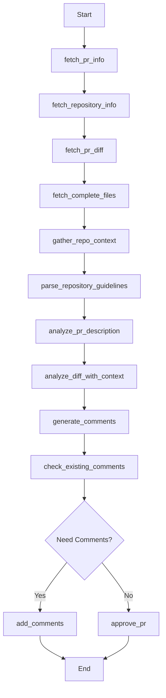

This document outlines the end state vision for the PR Review Agent.

## Purpose

The PR Review Agent is meant to be a tool that can be easily integrated as a GHA, an MCP server, or run locally. Often developers do not get PR reviews in a timely fashion, and so this tool is designed to help provide feedback to PRs on demand.

## High level requirements

The PR agent should be able to provide helpful and contextually relevant feedback to PRs as if it were a developer itself. What this means is that it should be able to take the following actions:

- Gain relevant context regarding PR changes
    - Repository code
    - PR diff
    - PR comments
    - Linked documentation in the PR description
- Add useful feedback to the PR
    - Should be placed where relevant
        - inline, body, or in a comment thread
    - Ask questions when changes are confusing, unclear, or seem potentially incorrect
    - Suggest changes when there are superior alternatives
    - Follow any documented review guidelines
    - Should know when NOT to comment
        - If another comment thread is already adressing the issue
        - If the suggestions do not tangibly improve the code quality
        - If the suggestions are not contextually relevant
        - If the code changes are robust, meet the goals of the overall project & current iteration of work, and do not have any glaring issues, then it should approve the PR with a LGTM comment

# Out of Scope for MVP
- Advanced & configurable review capabilities
- Concurrent Reviews. Some PRs may have multiple changesets, and need to be reviewed in tandem

# Technical Design

### File Structure
```
pr-review/
├── src/
│   ├── core/
│   │   ├── __init__.py
│   │   ├── pr_review_agent.py       # Main agent implementation
│   │   └── workflow.py              # LangGraph workflow definition
│   ├── models/
│   │   ├── __init__.py
│   │   └── pr_models.py             # Data models
│   ├── services/
│   │   ├── __init__.py
│   │   ├── github_service.py        # GitHub integration
│   │   └── llm_service.py           # LLM integration
│   ├── api/
│   │   ├── __init__.py
│   │   ├── server.py                # FastAPI server for MCP
│   │   └── routes.py                # API endpoints
│   ├── cli/
│   │   ├── __init__.py
│   │   └── commands.py              # CLI commands using Typer
│   ├── utils/
│   │   ├── __init__.py
│   │   ├── logging_utils.py         # Logging configuration
│   │   └── config_utils.py          # Configuration management
│   └── main.py                      # Entry point
├── tests/
│   ├── __init__.py
│   ├── test_github_service.py
│   ├── test_llm_service.py
│   └── test_pr_review_agent.py
├── .env.example                     # Example environment variables
├── requirements.txt                 # Dependencies
├── Dockerfile                       # For containerized deployment
└── README.md                        # Documentation
```

### LangGraph Workflow



### Service APIs

#### GitHubService API
```python
class GitHubService:
    def __init__(self, repository: Optional[str] = None, token: Optional[str] = None)
    def get_pull_request(self, pr_number: int) -> PullRequest
    def get_repository_info(self, repository: str) -> RepositoryInfo
    def get_pr_diff(self, pr_number: int) -> List[FileChange]
    def get_complete_file(self, repository: str, file_path: str, ref: str) -> str
    def get_pr_comments(self, pr_number: int) -> List[PRComment]
    def get_repository_structure(self, repository: str, ref: str) -> Dict[str, Any]
    def get_repository_docs(self, repository: str, ref: str) -> List[DocumentInfo]
    def get_repository_guidelines(self, repository: str) -> Optional[GuidelinesInfo]
    def get_linked_issues(self, pr_description: str) -> List[IssueInfo]
    def add_pr_comment(self, pr_number: int, comment: PRComment) -> PRComment
    def approve_pr(self, pr_number: int, message: str = "LGTM") -> bool
    def check_comment_thread_exists(self, pr_number: int, file_path: str, line: int) -> bool
```

#### LLMService API
```python
class LLMService:
    def __init__(self, model_name: str, base_url: str, api_key: Optional[str] = None, model_parameters: Optional[Dict[str, Any]] = None)
    def analyze_diff_with_context(self, file_path: str, diff_content: str, full_file_content: str, repository_context: Dict[str, Any], review_guidelines: Optional[GuidelinesInfo] = None) -> List[PRIssue]
    def analyze_pr_description(self, description: str, linked_issues: List[IssueInfo]) -> Dict[str, Any]
    def should_comment(self, issue: PRIssue, existing_comments: List[PRComment]) -> bool
    def should_approve(self, pull_request: PullRequest, detected_issues: List[PRIssue], review_guidelines: Optional[GuidelinesInfo] = None) -> bool
    async def retry_with_backoff(self, callable_func, *args, max_retries: int = 3, **kwargs) -> Any
```

#### PRReviewAgent API
```python
class PRReviewAgent:
    def __init__(self, github_service: GitHubService, llm_service: LLMService)
    async def review_pr(self, pr_number: int, repository: Optional[str] = None) -> PRReviewState
    async def fetch_pr_info(self, state: PRReviewState) -> PRReviewState
    async def fetch_repository_info(self, state: PRReviewState) -> PRReviewState
    async def fetch_pr_diff(self, state: PRReviewState) -> PRReviewState
    async def fetch_complete_files(self, state: PRReviewState) -> PRReviewState
    async def gather_repo_context(self, state: PRReviewState) -> PRReviewState
    async def parse_repository_guidelines(self, state: PRReviewState) -> PRReviewState
    async def analyze_pr_description(self, state: PRReviewState) -> PRReviewState
    async def analyze_diff_with_context(self, state: PRReviewState) -> PRReviewState
    async def generate_comments(self, state: PRReviewState) -> PRReviewState
    async def check_existing_comments(self, state: PRReviewState) -> PRReviewState
    async def add_comments(self, state: PRReviewState) -> PRReviewState
    async def approve_pr(self, state: PRReviewState) -> PRReviewState
    async def handle_error(self, state: PRReviewState, error: Exception, step: str) -> PRReviewState
```

### Credential Management

1. **Environment Variables**:
   - `GITHUB_TOKEN`: GitHub personal access token (used as fallback if GitHub CLI auth is not available)
   - `LLM_API_URL`: URL for the LLM API
   - `LLM_MODEL`: Model to use
   - `LLM_API_KEY`: API key for LLM service (if required)

2. **GitHub CLI Integration**:
   - Primary authentication method uses GitHub CLI credentials
   - Falls back to GITHUB_TOKEN if CLI is not available

3. **Configuration File**:
   - `.env` file for local development
   - GitHub Action secrets for GHA deployment
   - Environment variables for MCP server

### LLM Configuration

1. **Model Selection**:
   - Command-line argument: `--model`
   - Environment variable: `LLM_MODEL`
   - Configuration file setting
   - No hardcoded default to ensure explicit selection

2. **API Endpoint**:
   - Command-line argument: `--llm-url`
   - Environment variable: `LLM_API_URL`
   - Support for multiple LLM provider endpoints

3. **Model Parameters**:
   - Command-line arguments for common parameters (e.g., `--temperature`, `--max-tokens`)
   - Configuration file for detailed settings
   - Support for provider-specific parameters via configuration

4. **Provider Flexibility**:
   - Command-line argument: `--llm-provider`
   - Environment variable: `LLM_PROVIDER`
   - Supported providers defined in configuration

### Integration Methods

1. **CLI Interface**:
   ```bash
   # Local execution with configurable LLM
   python -m src.main review 123 --repo owner/repo --llm-provider openai --model gpt-4 --llm-url https://api.openai.com/v1
   ```

2. **Integration Hooks**:
   - The architecture will provide extension points for future integrations
   - Modular design allows for adding MCP server and GitHub Actions without core changes
   - Well-defined interfaces between components facilitate third-party integrations

### Data Models
```python
class RepositoryInfo(BaseModel):
    name: str
    description: Optional[str]
    default_branch: str
    languages: Dict[str, int]
    topics: List[str]
    has_wiki: bool
    has_issues: bool
    license: Optional[str]

class DocumentInfo(BaseModel):
    path: str
    content: str
    type: str  # e.g., "README", "CONTRIBUTING", "CODE_OF_CONDUCT"
    
class GuidelinesInfo(BaseModel):
    content: str
    source: str  # e.g., "CONTRIBUTING.md", ".github/PULL_REQUEST_TEMPLATE.md"
    parsed_rules: List[str] = Field(default_factory=list)
    
class IssueInfo(BaseModel):
    number: int
    title: str
    body: str
    labels: List[str] = Field(default_factory=list)
    
class PRIssue(BaseModel):
    file_path: str
    line_number: Optional[int]
    issue_type: str  # "question", "suggestion", "nitpick", "error", "praise"
    severity: str  # "low", "medium", "high"
    description: str
    suggestion: Optional[str]
    confidence: float
    
class PRComment(BaseModel):
    content: str
    file_path: Optional[str]
    line_number: Optional[int]
    is_suggestion: bool = False
    comment_type: str = "inline"  # "inline", "body", "thread"
    
class PRReviewState(BaseModel):
    pr_number: int
    repository: str
    pr_info: Optional[PullRequest] = None
    repository_info: Optional[RepositoryInfo] = None
    file_changes: List[FileChange] = Field(default_factory=list)
    complete_files: Dict[str, str] = Field(default_factory=dict)
    repository_context: Dict[str, Any] = Field(default_factory=dict)
    review_guidelines: Optional[GuidelinesInfo] = None
    pr_description_analysis: Dict[str, Any] = Field(default_factory=dict)
    linked_issues: List[IssueInfo] = Field(default_factory=list)
    detected_issues: List[PRIssue] = Field(default_factory=list)
    generated_comments: List[PRComment] = Field(default_factory=list)
    existing_comments: List[PRComment] = Field(default_factory=list)
    added_comments: List[PRComment] = Field(default_factory=list)
    approved: bool = False
    errors: List[Dict[str, Any]] = Field(default_factory=list)  # Enhanced error tracking
```

### Error Handling Strategy

1. **Robust Error Management**:
   - Structured error tracking in PRReviewState
   - Dedicated error handling methods
   - Graceful fallback for non-critical errors

2. **Retry Mechanism**:
   - Exponential backoff for API calls
   - Configurable retry limits
   - Service degradation handling

3. **Reporting**:
   - Clear error reporting in PR comments when critical
   - Detailed logging for debugging
   - Metrics collection for monitoring

### Configuration Management

In addition to the existing credential management, add:

1. **Review Policy Configuration**:
   - `REVIEW_STRICTNESS`: Level of strictness in reviews (permissive, balanced, strict)
   - `MAX_COMMENTS`: Limit on the number of comments to prevent overwhelming the PR
   - `COMMENT_THRESHOLD`: Confidence threshold for making comments
